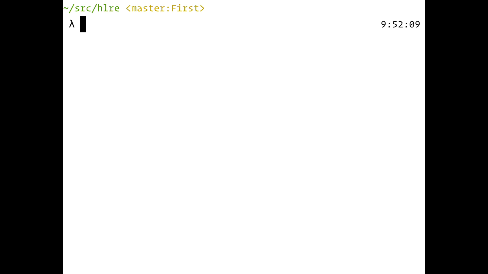

# hlre

Interactively **h**igh**l**ight **re**gular expression matches.



## What?

A TUI application that shows the matches of a (python-flavored) regular
expression as you type it.

## Why?

I really like using [RegExr](https://regexr.com/), but it uses the javascript
regex engine and there are some subtle differences between the results there and
what you get with python.

## Installation

```
python3 -m pip install hlre
```

## Usage

### TLDR

1. Run

    ```
    hlre -f nginx.log
    ```

1. Type a regex and see the matches highlighted in `nginx.log`.

1. Press `Control-C` to exit.

### Input Sources

You can either highlight matches with the built-in example text, a string passed
on the command line, or in an external file.

- Built-in Demo Text

    ```
    hlre --demo-text
    ```

- String

    ```
    hlre --text 'This is the regular expression subject.'
    ```

- External File

    ```
    hlre --file nginx.log
    ```

    Reading in the whole file can slow this tool down quite a bit, so you probably
    want to do something like:

    ```
    hlre --file <(head -n 10 nginx.log)
    ```

    To look at just the first 10 lines.

### Highlighting All Matches

By default, each line is treated as a seperate subject to match the regex on.

To highlight *all* matches in the subject, use the `-a` flag:

```
hlre --demo-text -a
# OR
hlre --file nginx.log --all
```

This uses `re.finditer` and the `re.MULTILINE` flag under the hood.

### Customizing Highlight Styles

`hlre` uses prompt toolkit's HTML functionality, so any tag name that works
there should work here. This tool does not currently support any custom
attributes on tags (e.g `style="..."`).

Here are some examples:

- Underline the entire match, highlight capture groups in a dark red

    ```
    hlre --demo-text --highlight-style u --group-highlight-style firebrick
    ```

- Highlight the entire match in green, bold the capture groups

    ```
    hlre --demo-text -s green -g b
    ```

- Italicize the entire match, highlight capture groups in cyan

    ```
    hlre --demo-text -s i -g cyan
    ```

